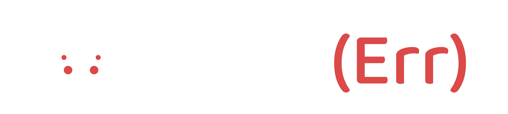

___

# 🚀 Projet d'Apothéose

## Introduction

Nous sommes en 2022, un grand projet se dessine pour l'apothéose qui arrive sur Cassini.

### Equipages

L'embarquement des 4 Cassiniens : **Julien**, **Pierre**, **Fredo** et **Hélène**, promet bien des aventures.

Jour après jour nous tiendrons ce carnet de bord à jour du démarrage à l'arrivée.

### Objectifs

L'objectif de cette mission est de créer une application dont les fonctionnalités servirons d'outils de veille d'apprentissage.

Cette application sera constitué d'articles et outils permettant à tous les développeuses et développeurs d'y trouver les ressources de son choix.

La partie sur laquelle nous souhaitons mettre en avant est l'apprentissage par l'erreur. Pourquoi ? Car les erreurs qui se créent lorsque nous développons nous font avancer, nous permettent d'optimiser nos choix.

Nous sommes entourés d'erreurs en tout genre, des plus compliqués, à ceux qui nous ont fait transpirer, parfois abandonner.

Et le but de notre mission est d'aller de l'avant !

*" Echouer, c'est avoir la possibilité de recommencer de manière plus intelligente. " Henry Ford*

### Un petit mot

Ce carnet est né d'un sujet qui nous tenait tous à coeur : l'entraide.

L'aventure que nous avons déjà vécue au sein de l'école O'Clock nous a montré les liens que pouvait créer les personnes entre elles pour aller plus loin et progresser ensemble, et les valeurs apprises suite à cette expérience seront gardées précieusement.

### Start ▶

On commence ? C'est par [là](./__Apotheose__/1-Conception/01_titre.md) !
