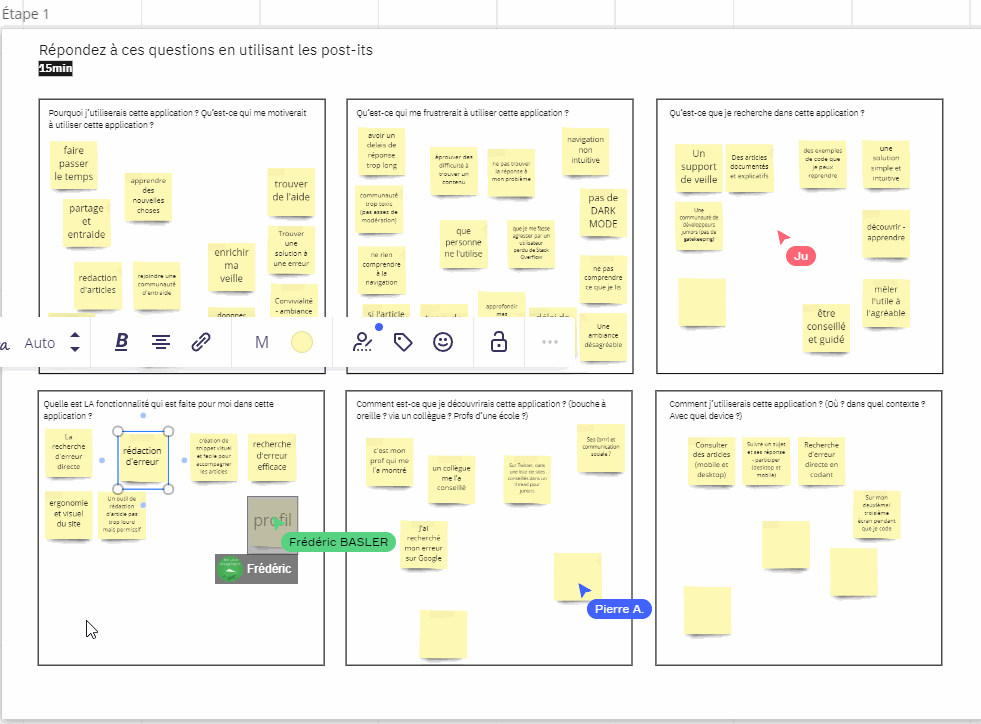
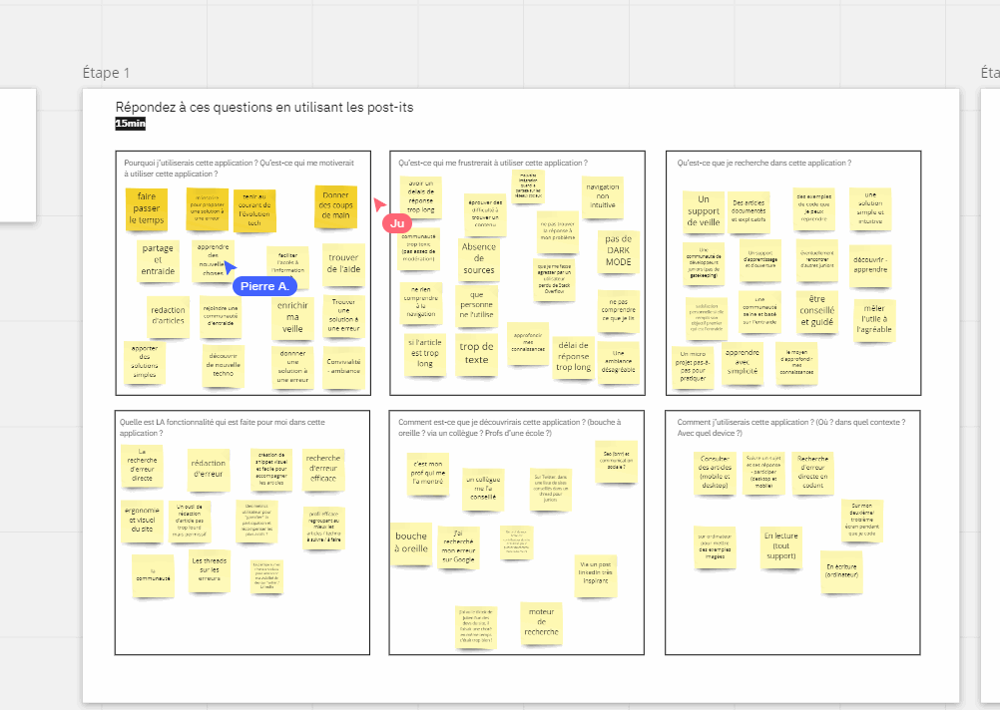
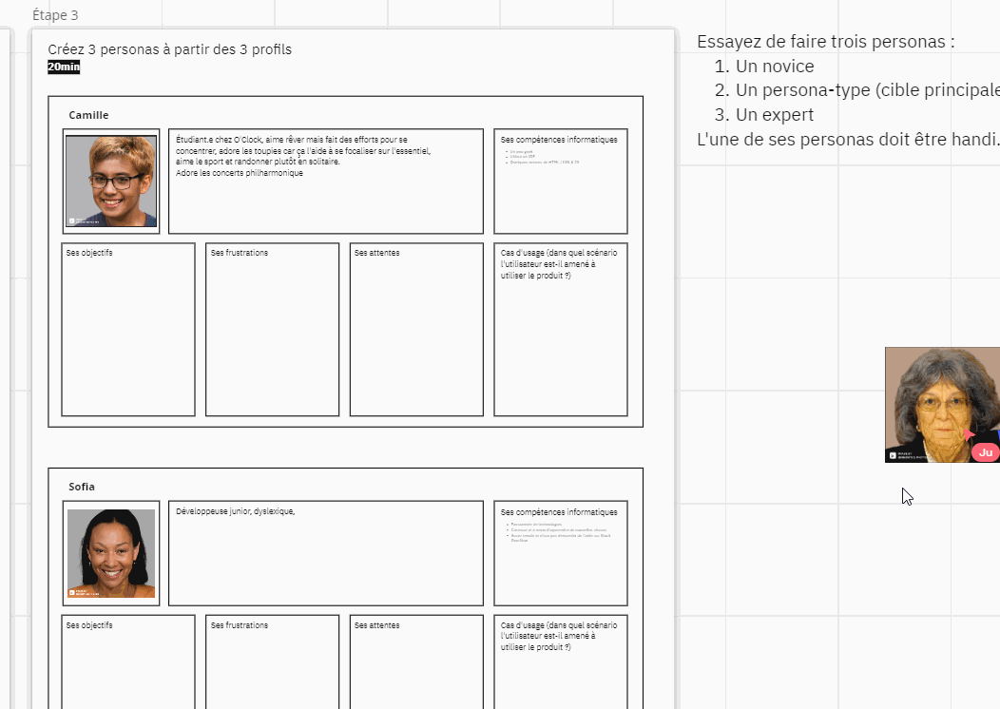
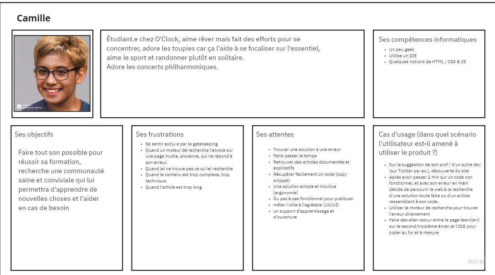
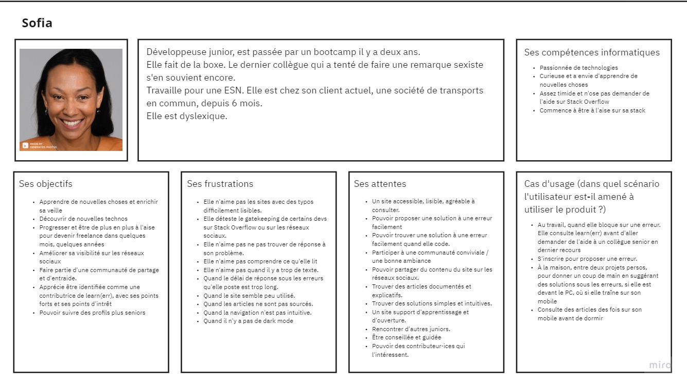
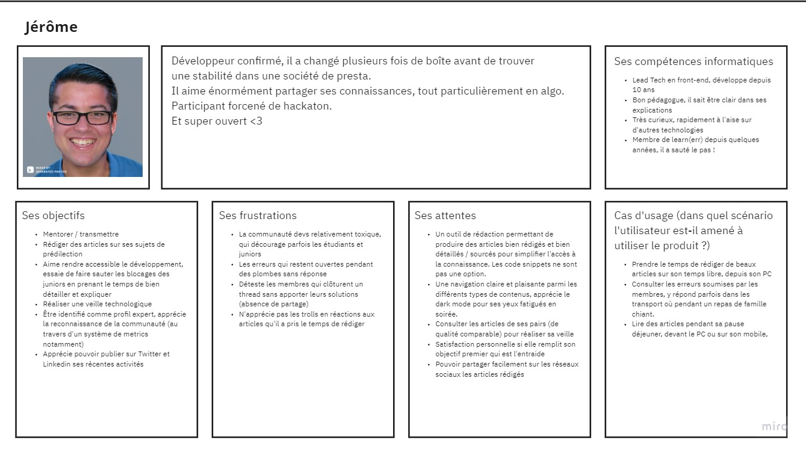

# Jour 1 : Proto-Personas

Date : 11/07/2022
___

- L'objectif de cette outil est de confronter le concepteur à l’utilisateur.
- Permet la visualisation du chemin et l'utilisation du site par les différents profils

___

## Outil

L'outil collaboratif que nous allons utiliser est : [Miro](https://miro.com/)

## Questionnements de l'utilisateur

- Pourquoi j’utiliserais cette application ?
- Qu’est-ce qui me motiverait à utiliser cette application ?
- Qu’est-ce qui me frustrerait à utiliser cette application ?
- Qu’est-ce que je recherche dans cette application ?
- Quelle est LA fonctionnalité qui est faite pour moi dans cette application ?
- Comment est-ce que je découvrirais cette application ? (bouche à oreille ? via un collègue ? Profs d’une école ?)
- Comment j’utiliserais cette application ? (Où ? dans quel contexte ? Avec quel device ?)

___

## Atelier de groupe

Préparation de l'atelier

### Objectifs

- Créer des personas qui représentent la manière dont on imagine nos futures utilisateurs

- Ces personas nous accompagneront tout au long du projet afin de mieux répondre à leurs besoins.

- Les personas sont un outil qui aide à garder en tête les objectifs et la direction du projet.

### Programme

- Session brainstorming autour de quelques questions

- Regrouper les post-its qui se ressemblent pour créer les personas

- Faire le storytelling des personas

___

### 1.  <u>Session brainstorming</u>

### 2. <u>Création des personas</u>

Classement des éléments et tri pour la création des personas

### 3. <u>Storytelling</u>

Description des personas, qui ils sont, ce qu'ils aiment, ce qui les caractérise.

On vous présente :

### Camille

Camille démarre sa formation chez O'Clock et est catégorisée comme novice.
Elle tombera sur Learn(err) lors de ses recherches sur les moteurs de recherche ou par le biais d'une information reçue par l'un de ses formateurs ou camarade de classe.

### Sofia

Sofia, elle, a fini sa formation chez O'Clock et est catégorisée comme junior. Elle commence à connaître Learn(err) et sait l'utiliser pour ses recherches.

### Jerome

Jérôme par contre, a une bonne connaissance sur le développement web et les différentes techno et est catégorisé comme senior. Il fait partie de l'équipe, contribue au bon dynamisme du site et est toujours présent pour aider.

___

[Page précédente](./00_Organisation.md) | [Page suivante](./02_User_stories.md) | [Accueil](../../README.md)

