# Wireframe

Date : 12/07/2022 - 13/07/2022
___

Le Wireframe permet d'avoir un schéma de la structure et des fonctionnalités de l'application mobile ou du site.

Cela nous permet d'avoir une structure à partir d'une maquette au graphisme simplifié.

Afin de créer notre wireframe qui va nous aider à visualiser l'agencement de la page, l'architecture des informations, les parcours utilisateurs et les fonctionnalités essentielles, nous avons tout d'abord rassemblé nos idées créatives dans un moodboard pour que toute l'équipe puisse prendre part à la création.

## Outil

L'outil collaboratif que nous allons utiliser est : 
[Figma](https://www.figma.com/)

## Moodboard

## Wireframe

Nous avons décidé de mettre en place un groupe de composants afin d'avoir une uniformité dans la construction de notre wireframe.

On démarre avec une base de composants que nous avons créé :

### <u>Composants</u>

Les composants que nous allons utiliser :

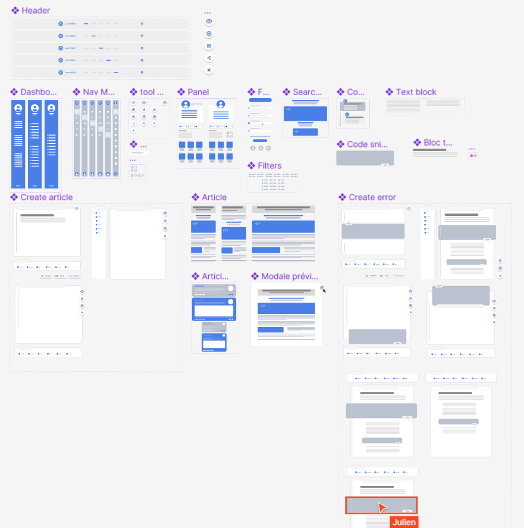

### <u>Wireframe Desktop</u>

Travail sur le wireframe version Desktop

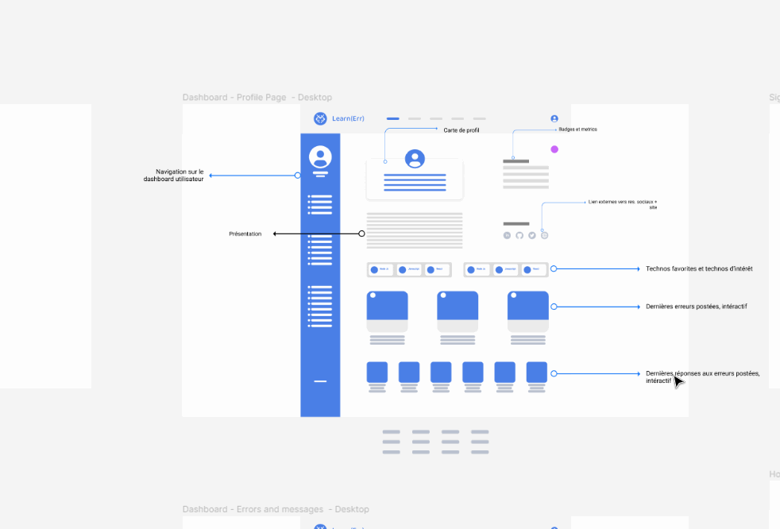

Aperçu global :

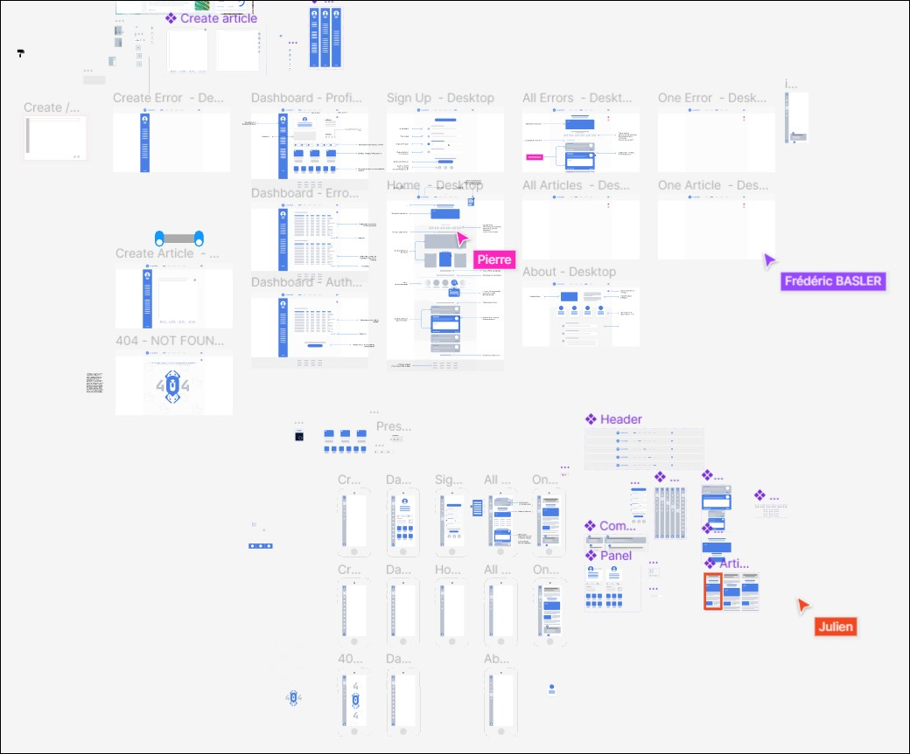

### <u>Wireframe Mobile</u>

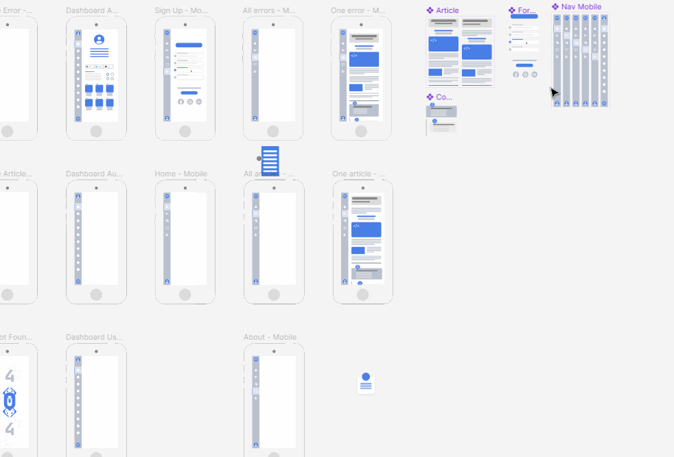

Aperçu global :

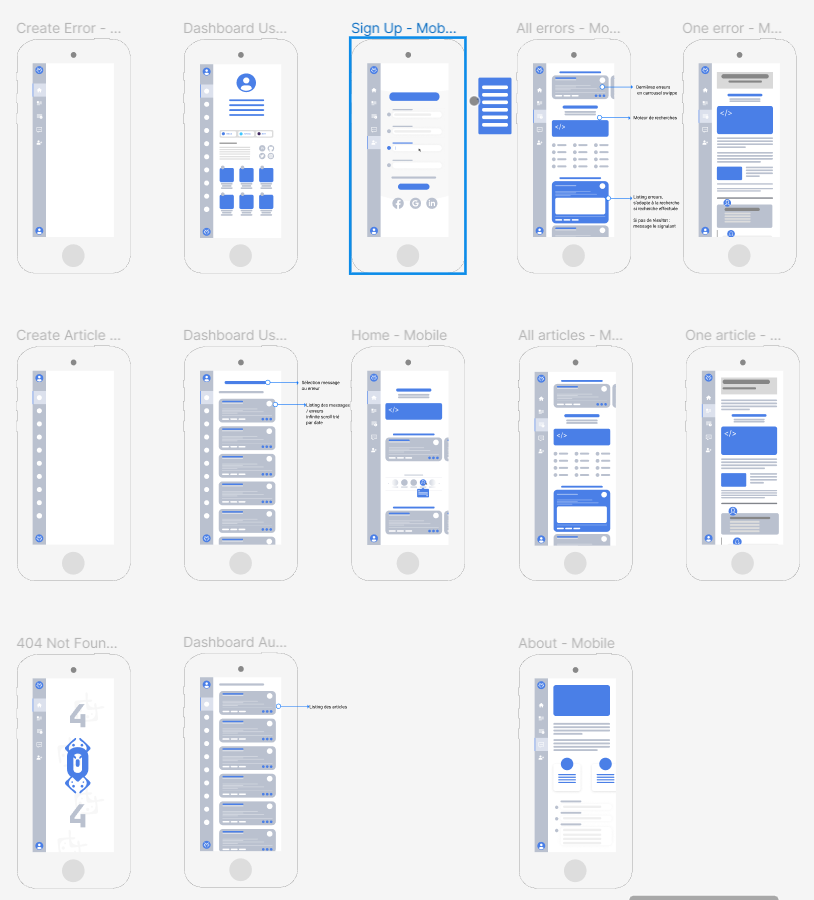

Aperçu dans le détail :

Homepage

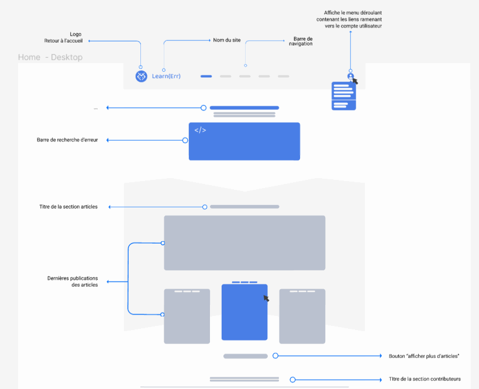

Les pages en détails

Formulaire

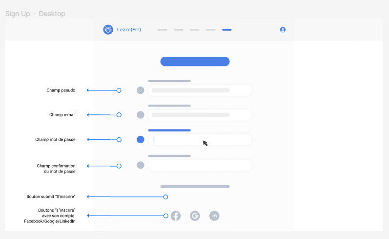

Un ticket d'erreur

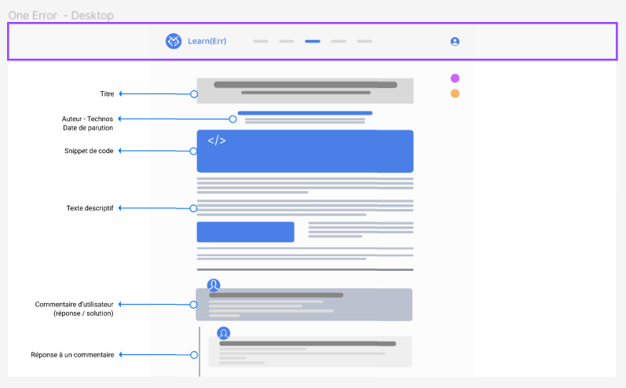

Tous les tickets d'erreur

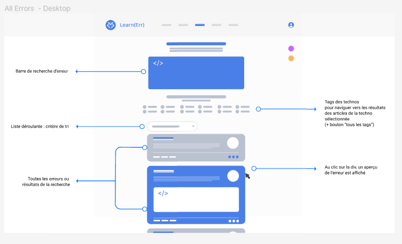

Profil

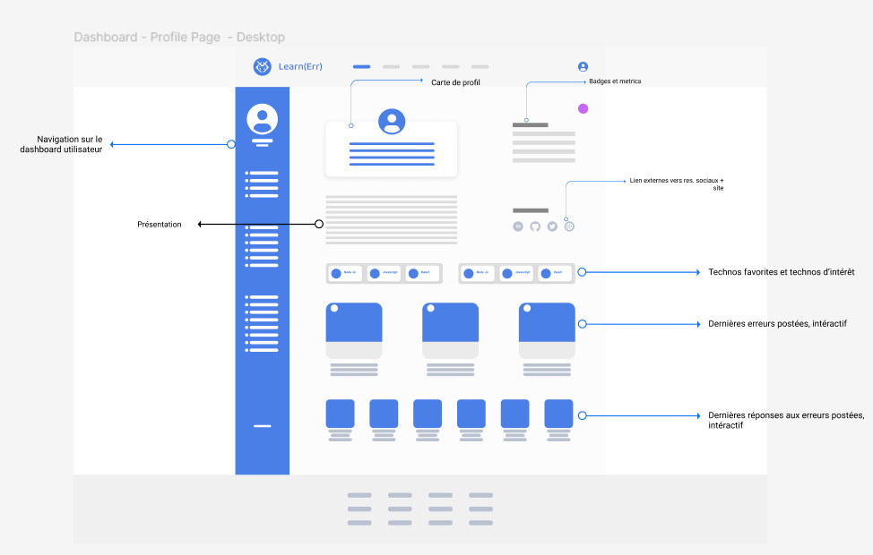

Dashboard

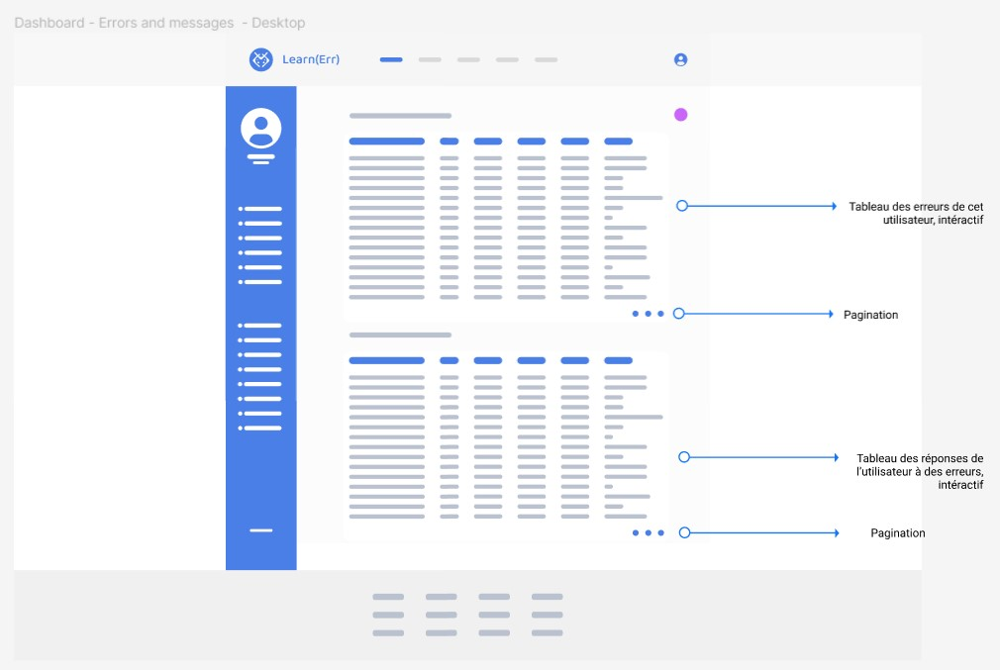

Prévisualisation

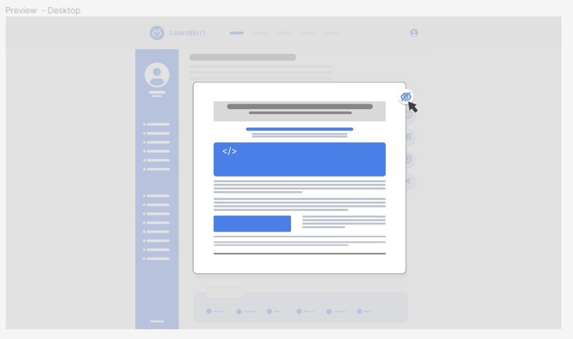

Page 404

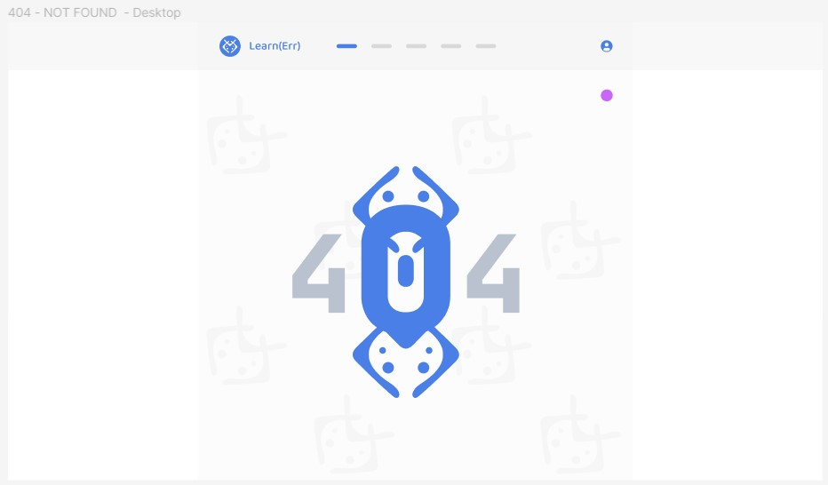

___

[Page précédente](./03_Fonctionnalites.md) | [Page suivante](./05_MCD_MLD_MPD.md) | [Accueil](../../README.md)
