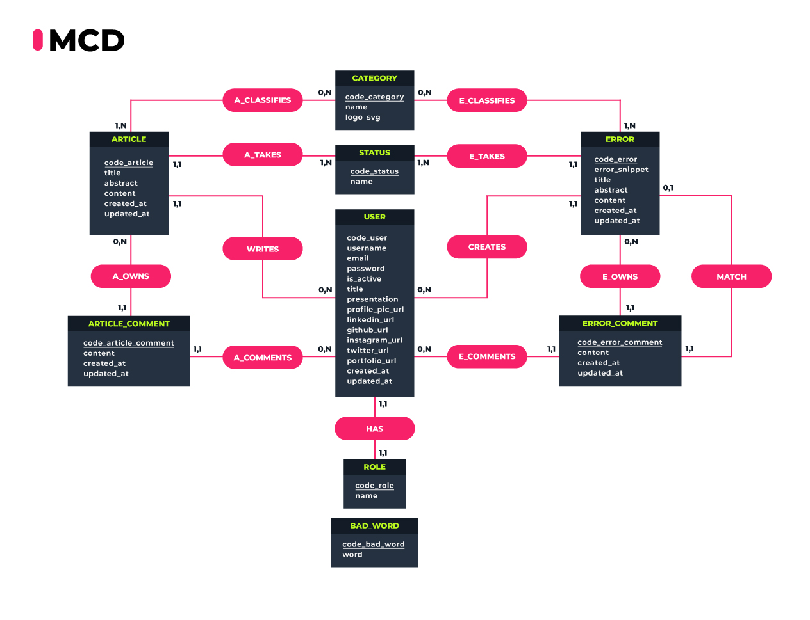
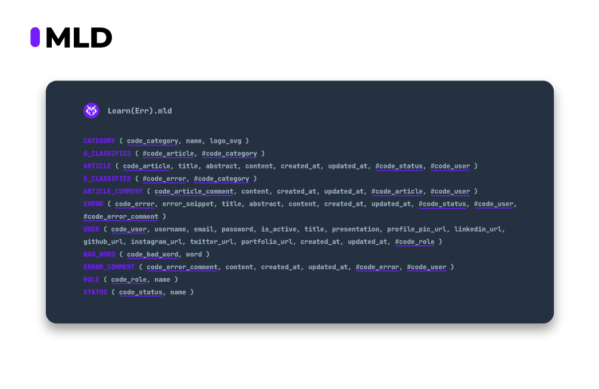
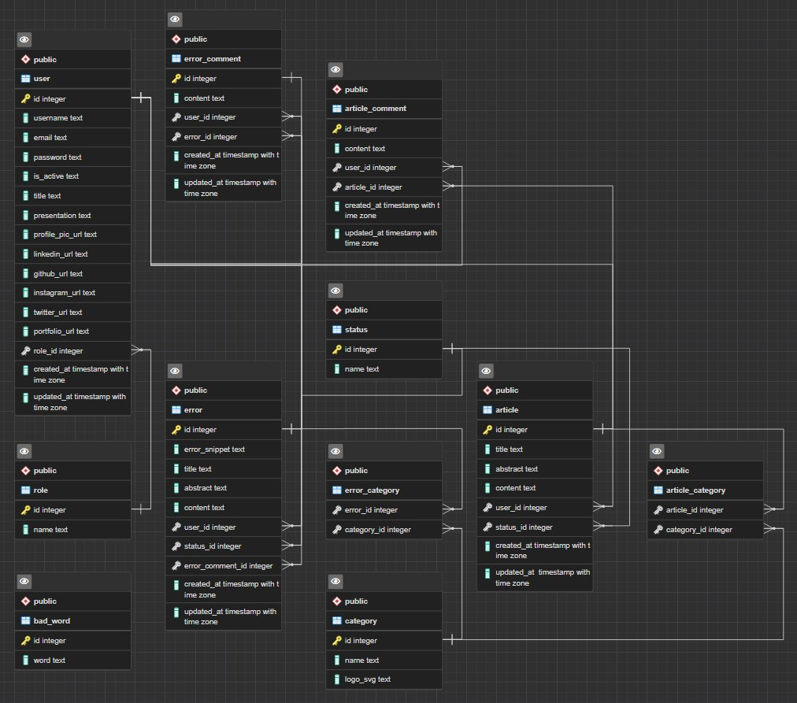

# MCD/MLD/MPD

Date : 13/07/2022 et 14/07/2022
___

## Introduction

Avant de visualiser le contenu et la composition de nos tables en base de données, nous devons tout d'abord mettre en place les associations qu'il peut exister entre les différentes entités

## Modèle Conceptuel de Données

Un **MCD** est une représentation d'un système, il s'agit d'un schéma **conceptuel** qui permettra de comprendre ou de simuler un sujet représenté par un modèle.

On va définir les différentes **associations** avec leurs **entités** selon la méthode [MERISE](https://fr.wikipedia.org/wiki/Merise_(informatique)) en définissant les différentes **cardinalités**.

La complexité ici est de définir les différentes entités et de se mettre en accord avec les idées mises en commun.

Nous avons donc fait un premier essai... :


Au vu de la complexité de la gestion des commentaires et des réponses aux commentaires, nous sommes partis sur des associations plus simplifiées et réalisable dans les temps/

VERSION 2 (retenue)

```txt
ARTICLE_COMMENT: code_article_comment, content, created_at, updated_at
A_COMMENTS, 0N USER, 11 ARTICLE_COMMENT
HAS, 11 USER, 11 ROLE
ROLE: code_role, name
:

A_OWNS, 0N ARTICLE, 11 ARTICLE_COMMENT
:
USER: code_user, username, email, password, is_active, title, presentation, profile_pic_url linkedin_url, github_url, instagram_url, twitter_url, portfolio_url, created_at, updated_at
E_COMMENTS, 0N USER, 11 ERROR_COMMENT
BAD_WORD: code_bad_word, word

ARTICLE: code_article, title, abstract, content, created_at, updated_at
WRITES, 0N USER, 11 ARTICLE
CREATES, 0N USER, 11 ERROR
MATCH, 11 ERROR, 01 ERROR_COMMENT
ERROR_COMMENT: code_error_comment, content, created_at, updated_at

A_CLASSIFIES, 1N ARTICLE, 0N CATEGORY
CATEGORY: code_category, name
E_CLASSIFIES, 1N ERROR, 0N CATEGORY
ERROR: code_error, title, abstract, content, created_at, updated_at
E_OWNS, 0N ERROR, 11 ERROR_COMMENT

STATUS: code_status, name
E_TAKES, 11 ERROR, 1N STATUS
A_TAKES, 11 ARTICLE, 1N STATUS
```

Ce qui nous donnera le résultat suivant :



## Modèle Logique de Données

Le **MLD** découle directement du MCD, cela devient plus concret et est une étape vers le modèle physique final.

Les **entités** du MCD deviennent des **tables**, les **propriétés** deviennent alors des **colonnes**.

L'**identifiant** de l'entité devient également une **colonne** comme les autres mais simplement assortie d'une **contrainte d'unicité** (La clé primaire sera un id auto-généré par le [SGBD](https://fr.wikipedia.org/wiki/Syst%C3%A8me_de_gestion_de_base_de_donn%C3%A9es))



## Modèle Physique de données

Le **MPD** permet de décrire la manière dont seront représentées nos données dans la base de données.

Celui-ci va représenter les **tables**, **colonnes** et **types** de données et sera construit en fonction de notre **SGBD** (Système de Gestion de Base de Données) qui sera [PostgreSQL](https://www.postgresql.org/).

Ci-dessous le diagram (ERD => Entity-Relationship Diagram) qui a été modélisé grâce à l'outil graphique [PgAdmin 4](https://www.pgadmin.org/) qui est un outil open-source pour Postgres.



___

[Page précédente](./04_Wireframe.md) | [Page suivante](./06_Endpoints.md) | [Accueil](../../README.md)
