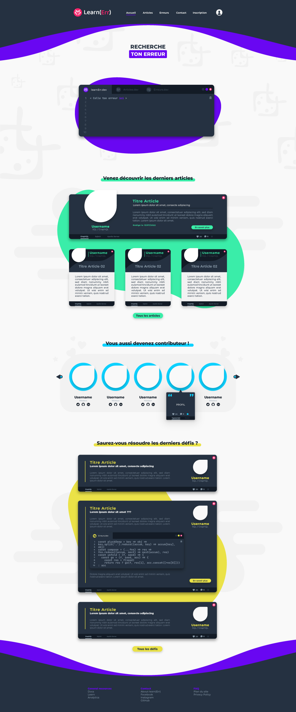
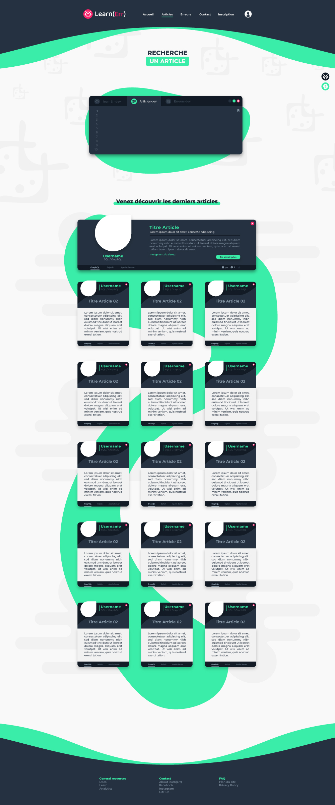
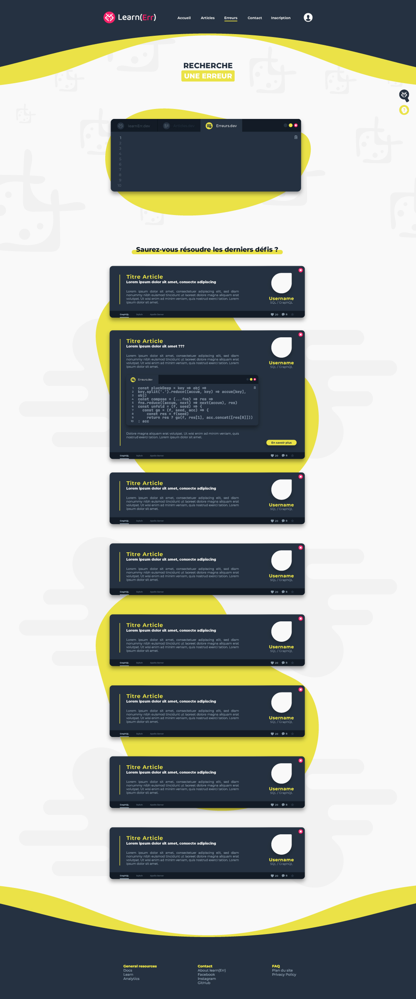
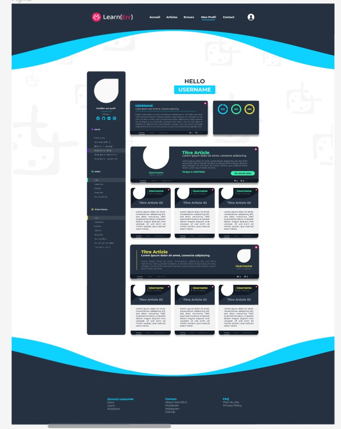
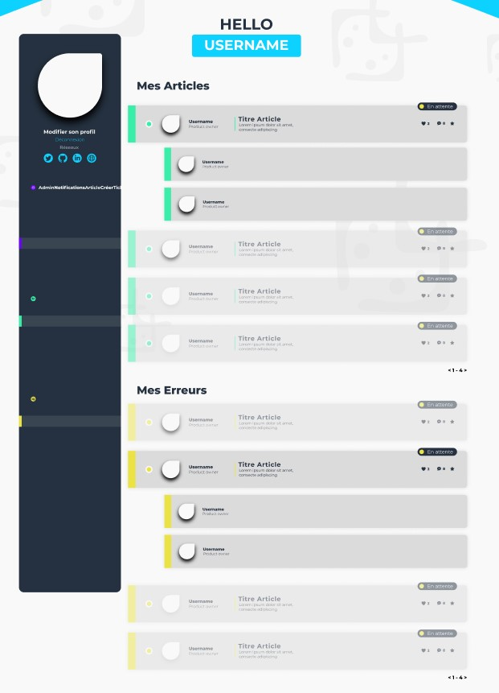
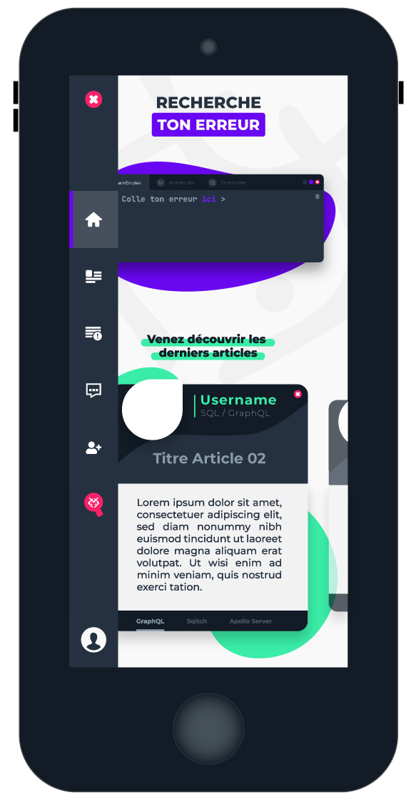
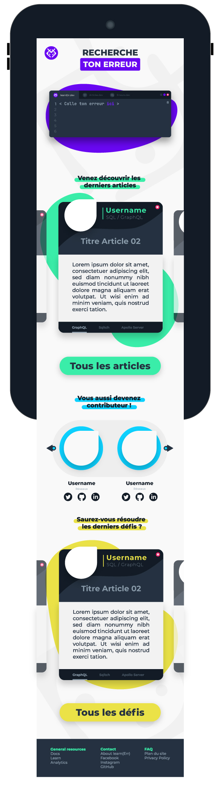

# Design

## Outils

Les outils utilisés pour la réalisation des designs : [Adobe Illustrator](https://www.adobe.com/fr/products/illustrator.html) et [Figma](https://www.figma.com/)

## Design page Home

___

## Design page Articles

___

## Design page Erreurs

___

## Design page profil

___

## Design page dashboard

___

## Design version mobile

### Home (short version)

### Home (full version)

___

[Page précédente](./07_Dico_de_donnees.md) | [Page suivante](./09_Preparation_composant.md) | [Accueil](../../README.md)
