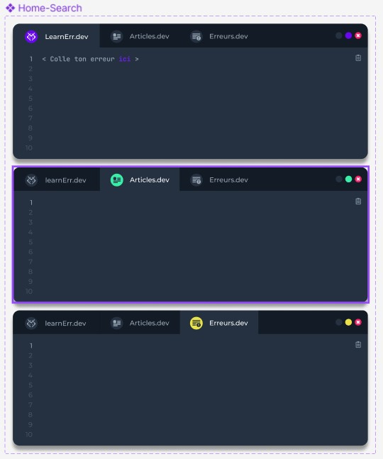
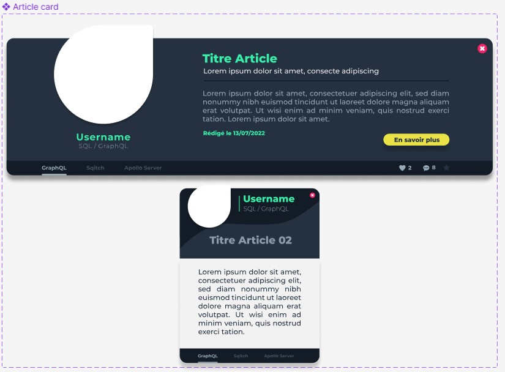
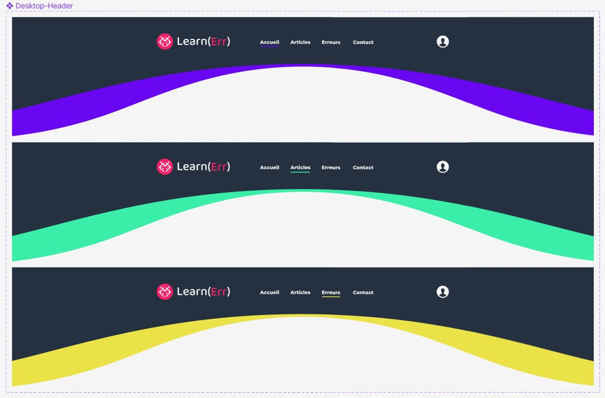
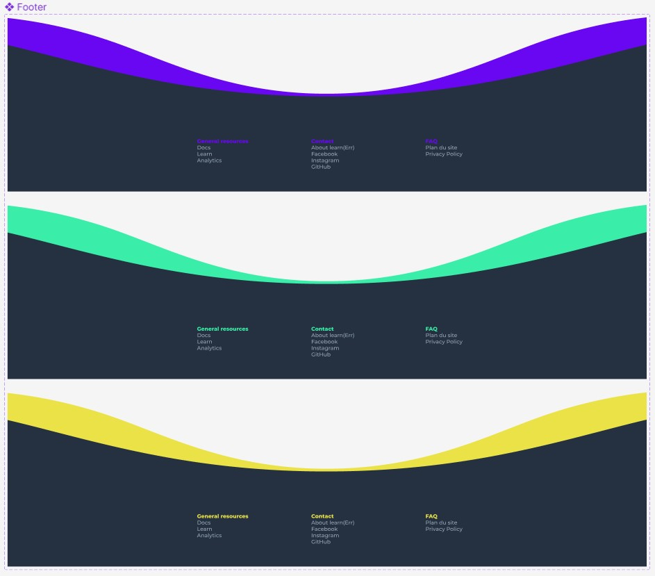
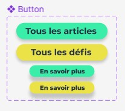
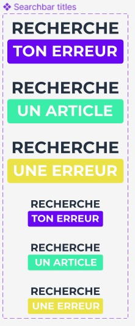
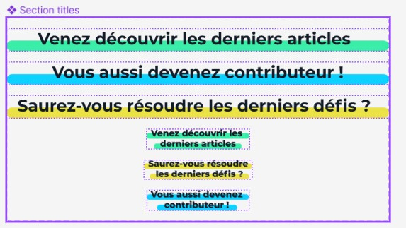

# Préparation des composants

Date : 15/07/2022 - 18/07/2022

___

## Outils

Les outils utilisés pour la réalisation des designs : [Adobe Illustrator](https://www.adobe.com/fr/products/illustrator.html) et [Figma](https://www.figma.com/)

## Décomposition

## Home search

## Article card

## Header desktop

## Footer

## Background

## Buttons

## Search bar title

## Titles

___

[Page précédente](./08_Design.md) | [Page suivante](./10_Pages.md) | [Accueil](../../README.md)
